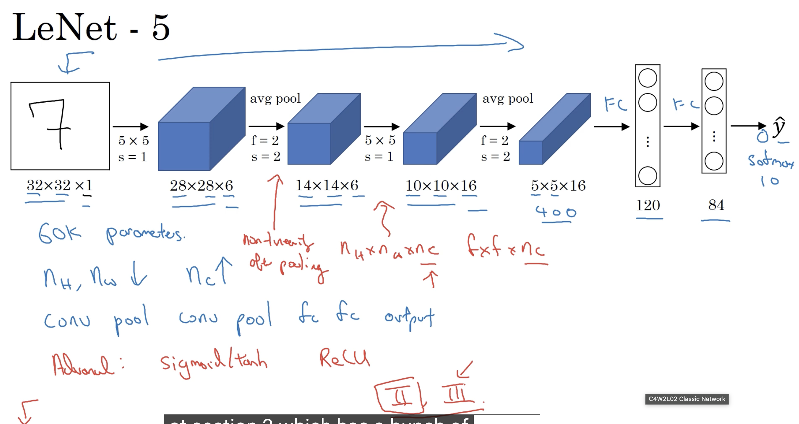
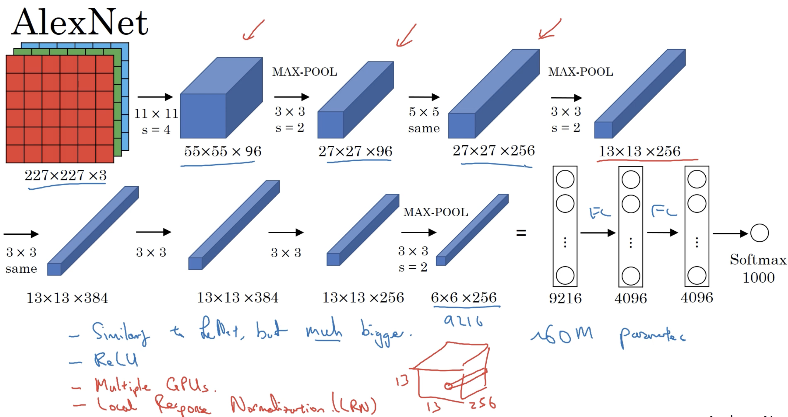
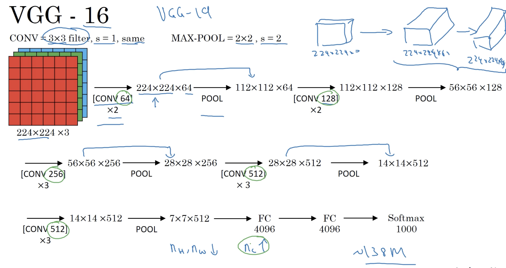

# 三大經典卷積神經網路：LeNet-5、AlexNet 與 VGG-16

本報告深入剖析深度學習發展史上最具代表性的三種經典卷積神經網路（Convolutional Neural Networks, CNN）—— **LeNet-5 (1998)**、**AlexNet (2012)** 與 **VGG-16 (2014)**。內容涵蓋其詳細架構特徵、演進邏輯、設計原則及技術歷史侷限。

---

## 概覽與演進對比

| 特徵 / 架構 | **LeNet-5 (1998)** | **AlexNet (2012)** | **VGG-16 (2014)** |
| :--- | :--- | :--- | :--- |
| **主要應用** | 手寫數字辨識 (MNIST) | 大規模影像分類 (ImageNet) | 大規模影像分類與特徵提取 |
| **輸入維度** | $32 \times 32 \times 1$ (灰階) | $227 \times 227 \times 3$ (彩色) | $224 \times 224 \times 3$ (彩色) |
| **總參數數量** | 約 60,000 (60K) | 約 6,000 萬 (60M) | 約 1.38 億 (138M) |
| **主要卷積核尺寸** | $5 \times 5$ | $11 \times 11$, $5 \times 5$, $3 \times 3$ | **統一為 $3 \times 3$** |
| **池化層類型** | 平均池化 (Average Pooling) | 最大池化 (Max Pooling, $3 \times 3$, Stride 2) | 最大池化 (Max Pooling, $2 \times 2$, Stride 2) |
| **激活函數** | Sigmoid / Tanh | **ReLU** | **ReLU** |
| **關鍵技術創新** | 首創 Conv-Pool-FC 基礎範式 | GPU 分散式訓練、Dropout、LRN | 極簡同構設計、小卷積核堆疊代替大核 |

---

## 一、 LeNet-5 (1998)



LeNet-5 由 Yann LeCun 等人在 1998 年提出，是卷積神經網路的開山之作，奠定了現代電腦視覺模型的基礎骨架。主要設計用於手寫數字辨識（0–9）。

### 1. 輸入維度
* **$32 \times 32 \times 1$** 的單通道灰階影像。

### 2. 詳細架構層級

```
[Input: 32x32x1] 
   └── Conv1 (6@5x5, s=1)   ──> [28x28x6]
   └── Pool1 (Avg 2x2, s=2) ──> [14x14x6]
   └── Conv2 (16@5x5, s=1)  ──> [10x10x16]
   └── Pool2 (Avg 2x2, s=2) ──> [5x5x16]
   └── Flatten              ──> [400 nodes]
   └── FC1                  ──> [120 nodes]
   └── FC2                  ──> [84 nodes]
   └── Output               ──> [10 classes]
```

1. **卷積層 1 (Conv1)**：使用 6 個 $5 \times 5$ 濾波器，步幅 (stride) = 1，無填充 (no padding)。輸出維度為 **$28 \times 28 \times 6$**。
2. **池化層 1 (Pool1)**：平均池化 (Average Pooling)，濾波器尺寸 $2 \times 2$，步幅 = 2。輸出維度減半至 **$14 \times 14 \times 6$**。
3. **卷積層 2 (Conv2)**：使用 16 個 $5 \times 5$ 濾波器，無填充（Valid Convolution）。輸出維度為 **$10 \times 10 \times 16$**。
4. **池化層 2 (Pool2)**：平均池化，濾波器尺寸 $2 \times 2$，步幅 = 2。輸出維度減半至 **$5 \times 5 \times 16$**（展平後為 400 個節點）。
5. **全連接層 1 (FC1)**：將 400 個節點連接至 **120 個神經元**。
6. **全連接層 2 (FC2)**：連接至 **84 個神經元**。
7. **輸出層 (Output)**：預測 10 個類別（0 到 9 的數字辨識）。

### 3. 參數規模
* **約 60,000 (60K) 個參數**，以現代深度學習標準來看極為輕量。

### 4. 經典設計規律與歷史特質
* **經典規律**：隨著網路愈深，空間維度逐漸縮減 $32 \to 28 \to 14 \to 10 \to 5$ ，而通道數逐漸增加 $1 \to 6 \to 16$ 奠定了「卷積 $\to$ 池化 $\to$ 卷積 $\to$ 池化 $\to$ 全連接」的經典範式。
* **激活函數**：使用 Sigmoid 與 Tanh，容易引發梯度消失問題。
* **稀疏連接設計**：由於當時算力嚴重的限制，Conv2 並未讓每個濾波器連接至 Pool1 的所有 6 個通道，而是採取特設的非對稱連接表以節省計算量與參數數量。

---

## 二、 AlexNet (2012)



AlexNet 由 Alex Krizhevsky、Ilya Sutskever 及 Geoffrey Hinton 設計，在 2012 年 ImageNet 大賽 (ILSVRC) 中以壓倒性優勢奪冠，開啟了深度學習的爆發時代。

### 1. 輸入維度
* **$227 \times 227 \times 3$** 的 RGB 彩色影像（論文文字標註為 $224 \times 224 \times 3$，但自第一層數學計算 $ (227-11)/4 + 1 = 55 $ 可知實際輸入應為 $227 \times 227$）。

### 2. 詳細架構層級

```
[Input: 227x227x3]
   └── Conv1 (96@11x11, s=4) ──> [55x55x96]
   └── Pool1 (Max 3x3, s=2)  ──> [27x27x96]
   └── Conv2 (256@5x5, same) ──> [27x27x256]
   └── Pool2 (Max 3x3, s=2)  ──> [13x13x256]
   └── Conv3 (384@3x3, same) ──> [13x13x384]
   └── Conv4 (384@3x3, same) ──> [13x13x384]
   └── Conv5 (256@3x3, same) ──> [13x13x256]
   └── Pool3 (Max 3x3, s=2)  ──> [6x6x256]
   └── Flatten               ──> [9,216 nodes]
   └── FC6                   ──> [4096 nodes]
   └── FC7                   ──> [4096 nodes]
   └── FC8 (Softmax)         ──> [1000 classes]
```

1. **卷積層 1**：96 個 $11 \times 11$ 濾波器，步幅 = 4。輸出維度為 **$55 \times 55 \times 96$**。
2. **池化層 1**：最大池化 (Max Pooling)，$3 \times 3$ 濾波器，步幅 = 2（重疊池化）。輸出維度為 **$27 \times 27 \times 96$**。
3. **卷積層 2**：256 個 $5 \times 5$ Same 卷積。輸出維度為 **$27 \times 27 \times 256$**。
4. **池化層 2**：最大池化，$3 \times 3$ 濾波器，步幅 = 2。輸出維度為 **$13 \times 13 \times 256$**。
5. **卷積層 3**：384 個 $3 \times 3$ Same 卷積。輸出維度為 **$13 \times 13 \times 384$**。
6. **卷積層 4**：384 個 $3 \times 3$ Same 卷積。輸出維度為 **$13 \times 13 \times 384$**。
7. **卷積層 5**：256 個 $3 \times 3$ Same 卷積。輸出維度為 **$13 \times 13 \times 256$**。
8. **池化層 3**：最大池化，$3 \times 3$ 濾波器，步幅 = 2。輸出維度為 **$6 \times 6 \times 256$**（展平後為 9,216 個節點）。
9. **全連接層 (FC6 - FC8)**：包含數個大型全連接層（4096 $\to$ 4096 $\to$ 1000），最後接上 Softmax 進行 1,000 類別預測。

### 3. 參數數量與核心技術
* **參數規模**：約 **6,000 萬 (60M)** 個參數，參數量約為 LeNet-5 的 1,000 倍。
* **ReLU 激活函數**：大幅加速了深度網路的梯度傳遞與收斂速度。
* **雙 GPU 切分訓練**：受限於當時單一 GTX 580 (3GB VRAM) 的記憶體上限，將網路拆分至兩張 GPU 並建立跨卡通訊。
* **局部響應歸一化 (LRN)**：模擬生物側抑制機制，在通道維度進行歸一化。後續研究顯示其效果可被 Batch Normalization 替代。

---

## 三、 VGG-16 (2014)



由牛津大學視覺幾何組（Visual Geometry Group, VGG）提出，VGG-16 以極具規律與對稱的美感著稱，推動了 CNN 架構邁向標準化與模組化。

### 1. 核心設計哲學
* **卷積層規格高度統一**：一律採用 **$3 \times 3$ 濾波器**、步幅 = 1，並始終搭配 **Same Padding**（保證卷積不改變 Feature Map 空間尺寸）。
* **池化層規格高度統一**：一律採用 **$2 \times 2$ 最大池化**、步幅 = 2（空間解析度精確減半）。
* **小核代替大核**：兩個堆疊的 $3 \times 3$ 卷積感受野相當於一個 $5 \times 5$ 卷積，但參數更少且能引入更多非線性激活層。

### 2. 架構結構與層級分組

輸入尺寸：**$224 \times 224 \times 3$**

```
[Input: 224x224x3]
   │
   ├── Block 1: Conv3-64  x2  ──> MaxPool ──> [112x112x64]
   ├── Block 2: Conv3-128 x2  ──> MaxPool ──> [56x56x128]
   ├── Block 3: Conv3-256 x3  ──> MaxPool ──> [28x28x256]
   ├── Block 4: Conv3-512 x3  ──> MaxPool ──> [14x14x512]
   └── Block 5: Conv3-512 x3  ──> MaxPool ──> [7x7x512]
   │
   ├── Flatten ──> [25,088 nodes]
   ├── FC1     ──> [4096 nodes]
   ├── FC2     ──> [4096 nodes]
   └── FC3     ──> [1000 classes] (Softmax)
```

### 3. 優缺點分析
* **優點（優美規律性）**：
  * 每經過一次池化，空間尺寸降為一半 $224 \to 112 \to 56 \to 28 \to 14 \to 7$。
  * 每經歷一個區塊，通道數剛好翻倍 $64 \to 128 \to 256 \to 512$。
  * 架構極易理解與遷移，廣泛應用於特徵提取器。
* **缺點（巨大的計算與儲存開銷）**：
  * 參數總數高達 **1.38 億 (138M)**，其中大部分集中於第一層全連接層$7 \times 7 \times 512 \times 4096 \approx 1.02$ 億參數。
  * 記憶體佔用極大，訓練與推論成本昂貴。

---

## 演進邏輯與總結

從 LeNet-5 到 AlexNet 再到 VGG-16，展現了卷積神經網路發展的三大關鍵趨勢：

1. **尺寸與深度的躍升**：從輕量級的 5 層模型演進至 16/19 層的深層網路，參數規模從 tens of KB 增長至數百 MB。
2. **結構的標準化與簡化**：由早期的手工設計（如 LeNet 的非對稱連接、AlexNet 的多尺寸大卷積核）轉變為 VGG 的高度組件化、統一規格$3 \times 3$ Conv + $2 \times 2$ MaxPool
3. **計算與優化技術的進步**：由 Sigmoid/Tanh 與 CPU/單 GPU 計算，演進至使用 ReLU、Dropout、大數據集與強大 GPU 集群，最終奠定現代視覺大模型的基石。
